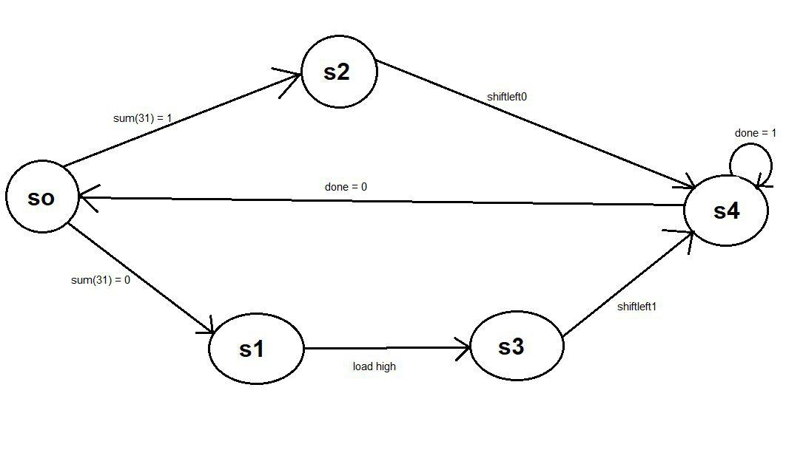

# 32-bit VHDL Divider

This repository contains the implementation of a 32-bit divider in VHDL, designed and simulated using Xilinx ISE. The project demonstrates a digital hardware implementation of division operations using VHDL hardware description language.

## Project Overview

The divider is implemented as a behavioral VHDL module that performs division operations on 32-bit numbers. The design follows standard digital design practices and has been verified through simulation.

### Features

- 32-bit division operation
- Behavioral VHDL implementation
- Fully synthesizable design
- Tested using Xilinx ISE simulation tools

## Documentation



For detailed information about the implementation, design decisions, and performance analysis, please refer to the [detailed report](REPORT.md).

## Project Structure

```
divisor/
├── division.vhd          # Main divider implementation
├── tb_phase2.vhd        # Testbench for phase 2
├── test.vhd             # Test implementation
└── [simulation files]   # Various simulation and project files
```

## Implementation Details

The divider is implemented in VHDL using IEEE standard logic libraries:
- IEEE.STD_LOGIC_1164.ALL
- IEEE.STD_LOGIC_ARITH.ALL
- IEEE.STD_LOGIC_UNSIGNED.ALL

## Getting Started

To use this project:

1. Clone this repository
2. Open the project in Xilinx ISE
3. The main implementation can be found in `divisor/division.vhd`
4. Run simulations using the provided testbenches

## Simulation

The project includes multiple testbench files for verification:
- `tb_phase2.vhd`: Main testbench for phase 2 testing
- `test.vhd`: Additional test scenarios
- Various `.prj` files for different simulation configurations

## License

This project is licensed under the terms included in the [LICENSE](LICENSE) file.

## Additional Resources

- Implementation photo: [View Photo](photo_2018-12-08_23-28-04.jpg)
- Technical documentation: [View Report](REPORT.md)
